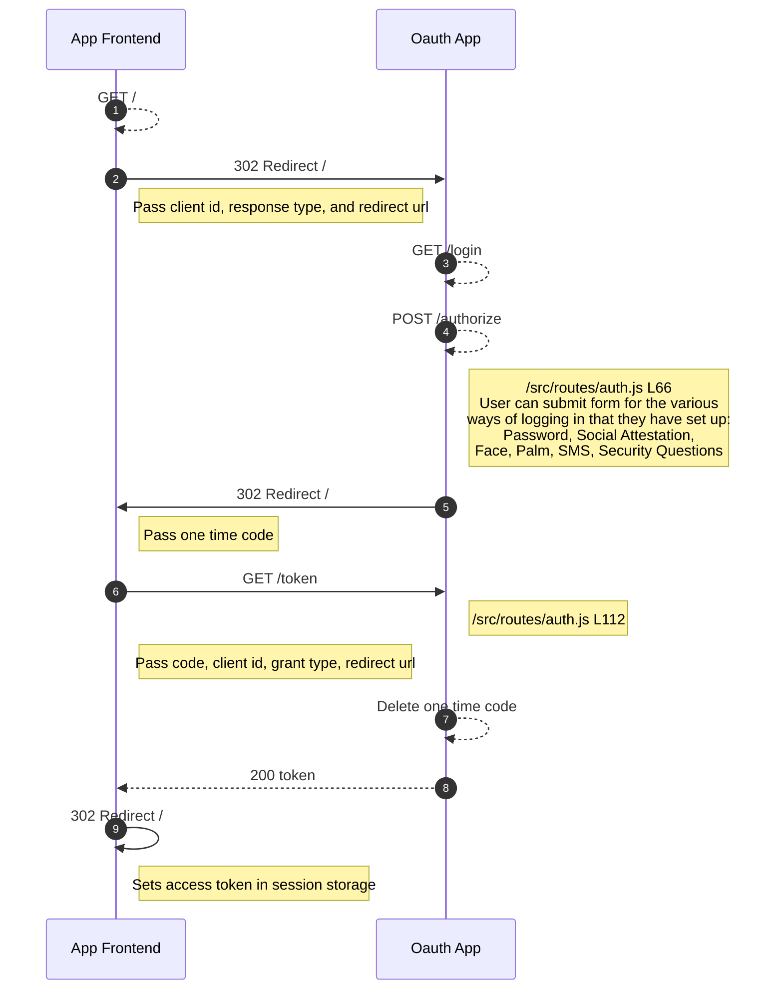

# Trauma Accessible Login

When people experience trauma, many of the online services they depended on become inaccessible. Mental and physical stress can make holding onto physical devices hard, maintaining social relationships difficult, and remembering passwords and security questions next to impossible. Furthermore, people experience and adapt to stress differently making it impractical to find a single authentication method that is accessible for everyone. The Trauma Accessible Login was designed in recognition that the login methods that work for some people may not work for all. Also, this attempts to meet people’s capabilities and comfort where they are that day, which is perhaps, not where they were when they initially signed up for the service.

The Trauma Accessible Login solution has 2 components

#### 1. A login page that presents multiple options for sign-in.

<kbd></kbd>

#### 2. An onboarding workflow that helps users think through what methods of login will be most accessible to them.

<kbd></kbd>

The intent of this login solution is that it be scalable to include as many login methods as can be helpful. For our initial POC we included 5 separate methods:

1. Password
2. Biometrics (palm print scan)
3. Security Questions
4. Two Factor Authentication
5. Social Attestation

## Oauth2.0

Because trauma accessible login features are needed for nearly all online services we implemented our multimodal as an Oauth2.0 server. This way any online service that already supports Oauth, can add an optional trauma accessible login without making large changes to their existing service. If you would like to add this service to your site, simply fork the repo and change the backing services from the mypass-backend to your own.

## Improved Biometrics Model

Part of being accessible to those experiencing trauma includes being sensitive to the fear that they may assign to specific methods of authentication. This is particularly true for any biometrics authentication. For the trauma accessible login, we addressed this fear through what we believe to be an improved biometrics model. We believe that if a user chooses to include biometrics as part of their sign-in process, that it should be private and secure by design. To ensure this, we have created a workflow that invites a user to put their device in airplane mode while completing biometric scans, such as facial recognition or fingerprint recognition. This ensures that all processing of sensitive biometric information is performed offline, and only once this information is converted to a safe form such as an abstracted template is the device reconnected to the internet.

<kbd></kbd>

Important to note that the biometrics model included in this module is a UI framework.  In order to perform function biometric authentication, a third party recognition API needs to be included.  While we are not in the position to make an endorsement of a private utility we have put together an implementation guide for making biometrics secure and private by design.

[Ethical Implimentation of Biomentrics](https://github.com/cityofaustin/Trauma-Accessible-Login/wiki/EthicalBiometrics)

## Design considerations.

The trauma accessible login service authenticates a user then provides an authorization code to the application server and provides stewardship of a user’s private keys which are shared with the browser on their device at login. This is a service that is unique to applications which must be secure through end to end encryption but serves a userbase that is unable to hold onto an encryption key themselves. It is because of this use case we have made the multimodal service as a stand-alone Oauth server capable of being hosted by a disinterested 3rd party or through ownerless governance.

Our data model has been specifically constructed such that the Oauth server contains no Personally Identifiable Information (PII) but prompts the application backing services to complete any operation needing PII. An example of this is two-factor authentication, where a one-time-code is generated by the Oauth server then sent to the application service to be paired with the user’s phone number or email address before being sent to the user to complete the authentication process. By removing all PII from the authentication service we believe that this becomes a better candidate for disinterested 3rd party hosting.

## Getting Started

The Trauma Accessible Login was designed to be installed in concert with the MyPass secure document solution. But if you would like to install this as a stand-alone project here are the following steps you will need:

    npm start
    git clone https://github.com/cityofaustin/multimodal-login
    cd dist
    cp ../.env ./
    cp ../package.json ./
    npm install --production
    npm run build

This endpoint runs at http://localhost:3000

## One Click Heroku Deployment

Alternatively you can deploy to heroku with one click:

### dev notes

to run the app in development mode I usually do a combination of `npm run dev` and `npm run webpack:watch` that way it transpiles the server code and the client code, you might be able to just do `npm run dev` but sometimes it seems like it doesn't load some client code sometimes. `npm start` also works but it doesn't do server live reload like `npm run dev` does.

## Authorization Code Flow Sequence Diagram

[![](https://mermaid.ink/img/eyJjb2RlIjoic2VxdWVuY2VEaWFncmFtXG4gICAgYXV0b251bWJlclxuICAgIEFwcCBGcm9udGVuZC0tPj5BcHAgRnJvbnRlbmQ6IEdFVCAvXG4gICAgQXBwIEZyb250ZW5kLT4-T2F1dGggQXBwOiAzMDIgUmVkaXJlY3QgL1xuICAgIE5vdGUgcmlnaHQgb2YgQXBwIEZyb250ZW5kOiBQYXNzIGNsaWVudCBpZCwgcmVzcG9uc2UgdHlwZSwgYW5kIHJlZGlyZWN0IHVybFxuICAgIE9hdXRoIEFwcC0tPj5PYXV0aCBBcHA6IEdFVCAvbG9naW5cbiAgICBPYXV0aCBBcHAtLT4-T2F1dGggQXBwOiBQT1NUIC9hdXRob3JpemVcbiAgICBOb3RlIHJpZ2h0IG9mIE9hdXRoIEFwcDogL3NyYy9yb3V0ZXMvYXV0aC5qcyBMNjY8YnIgLz4gVXNlciBjYW4gc3VibWl0IGZvcm0gZm9yIHRoZSB2YXJpb3VzPGJyLz4gd2F5cyBvZiBsb2dnaW5nIGluIHRoYXQgdGhleSBoYXZlIHNldCB1cDogPGJyLz5QYXNzd29yZCwgU29jaWFsIEF0dGVzdGF0aW9uLCA8YnIvPkZhY2UsIFBhbG0sIFNNUywgU2VjdXJpdHkgUXVlc3Rpb25zXG4gICAgT2F1dGggQXBwLT4-QXBwIEZyb250ZW5kOiAzMDIgUmVkaXJlY3QgL1xuICAgIE5vdGUgcmlnaHQgb2YgQXBwIEZyb250ZW5kOiBQYXNzIG9uZSB0aW1lIGNvZGVcbiAgICBBcHAgRnJvbnRlbmQtPj5PYXV0aCBBcHA6IEdFVCAvdG9rZW5cbiAgICBOb3RlIHJpZ2h0IG9mIE9hdXRoIEFwcDogL3NyYy9yb3V0ZXMvYXV0aC5qcyBMMTEyXG4gICAgTm90ZSByaWdodCBvZiBBcHAgRnJvbnRlbmQ6IFBhc3MgY29kZSwgY2xpZW50IGlkLCBncmFudCB0eXBlLCByZWRpcmVjdCB1cmxcbiAgICBPYXV0aCBBcHAtLT4-T2F1dGggQXBwOiBEZWxldGUgb25lIHRpbWUgY29kZVxuICAgIE9hdXRoIEFwcC0tPj5BcHAgRnJvbnRlbmQ6IDIwMCB0b2tlblxuICAgIEFwcCBGcm9udGVuZC0-PkFwcCBGcm9udGVuZDogMzAyIFJlZGlyZWN0IC9cbiAgICBOb3RlIHJpZ2h0IG9mIEFwcCBGcm9udGVuZDogU2V0cyBhY2Nlc3MgdG9rZW4gaW4gc2Vzc2lvbiBzdG9yYWdlIiwibWVybWFpZCI6eyJ0aGVtZSI6ImRlZmF1bHQiLCJ0aGVtZVZhcmlhYmxlcyI6eyJiYWNrZ3JvdW5kIjoid2hpdGUiLCJwcmltYXJ5Q29sb3IiOiIjRUNFQ0ZGIiwic2Vjb25kYXJ5Q29sb3IiOiIjZmZmZmRlIiwidGVydGlhcnlDb2xvciI6ImhzbCg4MCwgMTAwJSwgOTYuMjc0NTA5ODAzOSUpIiwicHJpbWFyeUJvcmRlckNvbG9yIjoiaHNsKDI0MCwgNjAlLCA4Ni4yNzQ1MDk4MDM5JSkiLCJzZWNvbmRhcnlCb3JkZXJDb2xvciI6ImhzbCg2MCwgNjAlLCA4My41Mjk0MTE3NjQ3JSkiLCJ0ZXJ0aWFyeUJvcmRlckNvbG9yIjoiaHNsKDgwLCA2MCUsIDg2LjI3NDUwOTgwMzklKSIsInByaW1hcnlUZXh0Q29sb3IiOiIjMTMxMzAwIiwic2Vjb25kYXJ5VGV4dENvbG9yIjoiIzAwMDAyMSIsInRlcnRpYXJ5VGV4dENvbG9yIjoicmdiKDkuNTAwMDAwMDAwMSwgOS41MDAwMDAwMDAxLCA5LjUwMDAwMDAwMDEpIiwibGluZUNvbG9yIjoiIzMzMzMzMyIsInRleHRDb2xvciI6IiMzMzMiLCJtYWluQmtnIjoiI0VDRUNGRiIsInNlY29uZEJrZyI6IiNmZmZmZGUiLCJib3JkZXIxIjoiIzkzNzBEQiIsImJvcmRlcjIiOiIjYWFhYTMzIiwiYXJyb3doZWFkQ29sb3IiOiIjMzMzMzMzIiwiZm9udEZhbWlseSI6IlwidHJlYnVjaGV0IG1zXCIsIHZlcmRhbmEsIGFyaWFsIiwiZm9udFNpemUiOiIxNnB4IiwibGFiZWxCYWNrZ3JvdW5kIjoiI2U4ZThlOCIsIm5vZGVCa2ciOiIjRUNFQ0ZGIiwibm9kZUJvcmRlciI6IiM5MzcwREIiLCJjbHVzdGVyQmtnIjoiI2ZmZmZkZSIsImNsdXN0ZXJCb3JkZXIiOiIjYWFhYTMzIiwiZGVmYXVsdExpbmtDb2xvciI6IiMzMzMzMzMiLCJ0aXRsZUNvbG9yIjoiIzMzMyIsImVkZ2VMYWJlbEJhY2tncm91bmQiOiIjZThlOGU4IiwiYWN0b3JCb3JkZXIiOiJoc2woMjU5LjYyNjE2ODIyNDMsIDU5Ljc3NjUzNjMxMjglLCA4Ny45MDE5NjA3ODQzJSkiLCJhY3RvckJrZyI6IiNFQ0VDRkYiLCJhY3RvclRleHRDb2xvciI6ImJsYWNrIiwiYWN0b3JMaW5lQ29sb3IiOiJncmV5Iiwic2lnbmFsQ29sb3IiOiIjMzMzIiwic2lnbmFsVGV4dENvbG9yIjoiIzMzMyIsImxhYmVsQm94QmtnQ29sb3IiOiIjRUNFQ0ZGIiwibGFiZWxCb3hCb3JkZXJDb2xvciI6ImhzbCgyNTkuNjI2MTY4MjI0MywgNTkuNzc2NTM2MzEyOCUsIDg3LjkwMTk2MDc4NDMlKSIsImxhYmVsVGV4dENvbG9yIjoiYmxhY2siLCJsb29wVGV4dENvbG9yIjoiYmxhY2siLCJub3RlQm9yZGVyQ29sb3IiOiIjYWFhYTMzIiwibm90ZUJrZ0NvbG9yIjoiI2ZmZjVhZCIsIm5vdGVUZXh0Q29sb3IiOiJibGFjayIsImFjdGl2YXRpb25Cb3JkZXJDb2xvciI6IiM2NjYiLCJhY3RpdmF0aW9uQmtnQ29sb3IiOiIjZjRmNGY0Iiwic2VxdWVuY2VOdW1iZXJDb2xvciI6IndoaXRlIiwic2VjdGlvbkJrZ0NvbG9yIjoicmdiYSgxMDIsIDEwMiwgMjU1LCAwLjQ5KSIsImFsdFNlY3Rpb25Ca2dDb2xvciI6IndoaXRlIiwic2VjdGlvbkJrZ0NvbG9yMiI6IiNmZmY0MDAiLCJ0YXNrQm9yZGVyQ29sb3IiOiIjNTM0ZmJjIiwidGFza0JrZ0NvbG9yIjoiIzhhOTBkZCIsInRhc2tUZXh0TGlnaHRDb2xvciI6IndoaXRlIiwidGFza1RleHRDb2xvciI6IndoaXRlIiwidGFza1RleHREYXJrQ29sb3IiOiJibGFjayIsInRhc2tUZXh0T3V0c2lkZUNvbG9yIjoiYmxhY2siLCJ0YXNrVGV4dENsaWNrYWJsZUNvbG9yIjoiIzAwMzE2MyIsImFjdGl2ZVRhc2tCb3JkZXJDb2xvciI6IiM1MzRmYmMiLCJhY3RpdmVUYXNrQmtnQ29sb3IiOiIjYmZjN2ZmIiwiZ3JpZENvbG9yIjoibGlnaHRncmV5IiwiZG9uZVRhc2tCa2dDb2xvciI6ImxpZ2h0Z3JleSIsImRvbmVUYXNrQm9yZGVyQ29sb3IiOiJncmV5IiwiY3JpdEJvcmRlckNvbG9yIjoiI2ZmODg4OCIsImNyaXRCa2dDb2xvciI6InJlZCIsInRvZGF5TGluZUNvbG9yIjoicmVkIiwibGFiZWxDb2xvciI6ImJsYWNrIiwiZXJyb3JCa2dDb2xvciI6IiM1NTIyMjIiLCJlcnJvclRleHRDb2xvciI6IiM1NTIyMjIiLCJjbGFzc1RleHQiOiIjMTMxMzAwIiwiZmlsbFR5cGUwIjoiI0VDRUNGRiIsImZpbGxUeXBlMSI6IiNmZmZmZGUiLCJmaWxsVHlwZTIiOiJoc2woMzA0LCAxMDAlLCA5Ni4yNzQ1MDk4MDM5JSkiLCJmaWxsVHlwZTMiOiJoc2woMTI0LCAxMDAlLCA5My41Mjk0MTE3NjQ3JSkiLCJmaWxsVHlwZTQiOiJoc2woMTc2LCAxMDAlLCA5Ni4yNzQ1MDk4MDM5JSkiLCJmaWxsVHlwZTUiOiJoc2woLTQsIDEwMCUsIDkzLjUyOTQxMTc2NDclKSIsImZpbGxUeXBlNiI6ImhzbCg4LCAxMDAlLCA5Ni4yNzQ1MDk4MDM5JSkiLCJmaWxsVHlwZTciOiJoc2woMTg4LCAxMDAlLCA5My41Mjk0MTE3NjQ3JSkifX0sInVwZGF0ZUVkaXRvciI6ZmFsc2V9)](https://mermaid-js.github.io/mermaid-live-editor/#/edit/eyJjb2RlIjoic2VxdWVuY2VEaWFncmFtXG4gICAgYXV0b251bWJlclxuICAgIEFwcCBGcm9udGVuZC0tPj5BcHAgRnJvbnRlbmQ6IEdFVCAvXG4gICAgQXBwIEZyb250ZW5kLT4-T2F1dGggQXBwOiAzMDIgUmVkaXJlY3QgL1xuICAgIE5vdGUgcmlnaHQgb2YgQXBwIEZyb250ZW5kOiBQYXNzIGNsaWVudCBpZCwgcmVzcG9uc2UgdHlwZSwgYW5kIHJlZGlyZWN0IHVybFxuICAgIE9hdXRoIEFwcC0tPj5PYXV0aCBBcHA6IEdFVCAvbG9naW5cbiAgICBPYXV0aCBBcHAtLT4-T2F1dGggQXBwOiBQT1NUIC9hdXRob3JpemVcbiAgICBOb3RlIHJpZ2h0IG9mIE9hdXRoIEFwcDogL3NyYy9yb3V0ZXMvYXV0aC5qcyBMNjY8YnIgLz4gVXNlciBjYW4gc3VibWl0IGZvcm0gZm9yIHRoZSB2YXJpb3VzPGJyLz4gd2F5cyBvZiBsb2dnaW5nIGluIHRoYXQgdGhleSBoYXZlIHNldCB1cDogPGJyLz5QYXNzd29yZCwgU29jaWFsIEF0dGVzdGF0aW9uLCA8YnIvPkZhY2UsIFBhbG0sIFNNUywgU2VjdXJpdHkgUXVlc3Rpb25zXG4gICAgT2F1dGggQXBwLT4-QXBwIEZyb250ZW5kOiAzMDIgUmVkaXJlY3QgL1xuICAgIE5vdGUgcmlnaHQgb2YgQXBwIEZyb250ZW5kOiBQYXNzIG9uZSB0aW1lIGNvZGVcbiAgICBBcHAgRnJvbnRlbmQtPj5PYXV0aCBBcHA6IEdFVCAvdG9rZW5cbiAgICBOb3RlIHJpZ2h0IG9mIE9hdXRoIEFwcDogL3NyYy9yb3V0ZXMvYXV0aC5qcyBMMTEyXG4gICAgTm90ZSByaWdodCBvZiBBcHAgRnJvbnRlbmQ6IFBhc3MgY29kZSwgY2xpZW50IGlkLCBncmFudCB0eXBlLCByZWRpcmVjdCB1cmxcbiAgICBPYXV0aCBBcHAtLT4-T2F1dGggQXBwOiBEZWxldGUgb25lIHRpbWUgY29kZVxuICAgIE9hdXRoIEFwcC0tPj5BcHAgRnJvbnRlbmQ6IDIwMCB0b2tlblxuICAgIEFwcCBGcm9udGVuZC0-PkFwcCBGcm9udGVuZDogMzAyIFJlZGlyZWN0IC9cbiAgICBOb3RlIHJpZ2h0IG9mIEFwcCBGcm9udGVuZDogU2V0cyBhY2Nlc3MgdG9rZW4gaW4gc2Vzc2lvbiBzdG9yYWdlIiwibWVybWFpZCI6eyJ0aGVtZSI6ImRlZmF1bHQiLCJ0aGVtZVZhcmlhYmxlcyI6eyJiYWNrZ3JvdW5kIjoid2hpdGUiLCJwcmltYXJ5Q29sb3IiOiIjRUNFQ0ZGIiwic2Vjb25kYXJ5Q29sb3IiOiIjZmZmZmRlIiwidGVydGlhcnlDb2xvciI6ImhzbCg4MCwgMTAwJSwgOTYuMjc0NTA5ODAzOSUpIiwicHJpbWFyeUJvcmRlckNvbG9yIjoiaHNsKDI0MCwgNjAlLCA4Ni4yNzQ1MDk4MDM5JSkiLCJzZWNvbmRhcnlCb3JkZXJDb2xvciI6ImhzbCg2MCwgNjAlLCA4My41Mjk0MTE3NjQ3JSkiLCJ0ZXJ0aWFyeUJvcmRlckNvbG9yIjoiaHNsKDgwLCA2MCUsIDg2LjI3NDUwOTgwMzklKSIsInByaW1hcnlUZXh0Q29sb3IiOiIjMTMxMzAwIiwic2Vjb25kYXJ5VGV4dENvbG9yIjoiIzAwMDAyMSIsInRlcnRpYXJ5VGV4dENvbG9yIjoicmdiKDkuNTAwMDAwMDAwMSwgOS41MDAwMDAwMDAxLCA5LjUwMDAwMDAwMDEpIiwibGluZUNvbG9yIjoiIzMzMzMzMyIsInRleHRDb2xvciI6IiMzMzMiLCJtYWluQmtnIjoiI0VDRUNGRiIsInNlY29uZEJrZyI6IiNmZmZmZGUiLCJib3JkZXIxIjoiIzkzNzBEQiIsImJvcmRlcjIiOiIjYWFhYTMzIiwiYXJyb3doZWFkQ29sb3IiOiIjMzMzMzMzIiwiZm9udEZhbWlseSI6IlwidHJlYnVjaGV0IG1zXCIsIHZlcmRhbmEsIGFyaWFsIiwiZm9udFNpemUiOiIxNnB4IiwibGFiZWxCYWNrZ3JvdW5kIjoiI2U4ZThlOCIsIm5vZGVCa2ciOiIjRUNFQ0ZGIiwibm9kZUJvcmRlciI6IiM5MzcwREIiLCJjbHVzdGVyQmtnIjoiI2ZmZmZkZSIsImNsdXN0ZXJCb3JkZXIiOiIjYWFhYTMzIiwiZGVmYXVsdExpbmtDb2xvciI6IiMzMzMzMzMiLCJ0aXRsZUNvbG9yIjoiIzMzMyIsImVkZ2VMYWJlbEJhY2tncm91bmQiOiIjZThlOGU4IiwiYWN0b3JCb3JkZXIiOiJoc2woMjU5LjYyNjE2ODIyNDMsIDU5Ljc3NjUzNjMxMjglLCA4Ny45MDE5NjA3ODQzJSkiLCJhY3RvckJrZyI6IiNFQ0VDRkYiLCJhY3RvclRleHRDb2xvciI6ImJsYWNrIiwiYWN0b3JMaW5lQ29sb3IiOiJncmV5Iiwic2lnbmFsQ29sb3IiOiIjMzMzIiwic2lnbmFsVGV4dENvbG9yIjoiIzMzMyIsImxhYmVsQm94QmtnQ29sb3IiOiIjRUNFQ0ZGIiwibGFiZWxCb3hCb3JkZXJDb2xvciI6ImhzbCgyNTkuNjI2MTY4MjI0MywgNTkuNzc2NTM2MzEyOCUsIDg3LjkwMTk2MDc4NDMlKSIsImxhYmVsVGV4dENvbG9yIjoiYmxhY2siLCJsb29wVGV4dENvbG9yIjoiYmxhY2siLCJub3RlQm9yZGVyQ29sb3IiOiIjYWFhYTMzIiwibm90ZUJrZ0NvbG9yIjoiI2ZmZjVhZCIsIm5vdGVUZXh0Q29sb3IiOiJibGFjayIsImFjdGl2YXRpb25Cb3JkZXJDb2xvciI6IiM2NjYiLCJhY3RpdmF0aW9uQmtnQ29sb3IiOiIjZjRmNGY0Iiwic2VxdWVuY2VOdW1iZXJDb2xvciI6IndoaXRlIiwic2VjdGlvbkJrZ0NvbG9yIjoicmdiYSgxMDIsIDEwMiwgMjU1LCAwLjQ5KSIsImFsdFNlY3Rpb25Ca2dDb2xvciI6IndoaXRlIiwic2VjdGlvbkJrZ0NvbG9yMiI6IiNmZmY0MDAiLCJ0YXNrQm9yZGVyQ29sb3IiOiIjNTM0ZmJjIiwidGFza0JrZ0NvbG9yIjoiIzhhOTBkZCIsInRhc2tUZXh0TGlnaHRDb2xvciI6IndoaXRlIiwidGFza1RleHRDb2xvciI6IndoaXRlIiwidGFza1RleHREYXJrQ29sb3IiOiJibGFjayIsInRhc2tUZXh0T3V0c2lkZUNvbG9yIjoiYmxhY2siLCJ0YXNrVGV4dENsaWNrYWJsZUNvbG9yIjoiIzAwMzE2MyIsImFjdGl2ZVRhc2tCb3JkZXJDb2xvciI6IiM1MzRmYmMiLCJhY3RpdmVUYXNrQmtnQ29sb3IiOiIjYmZjN2ZmIiwiZ3JpZENvbG9yIjoibGlnaHRncmV5IiwiZG9uZVRhc2tCa2dDb2xvciI6ImxpZ2h0Z3JleSIsImRvbmVUYXNrQm9yZGVyQ29sb3IiOiJncmV5IiwiY3JpdEJvcmRlckNvbG9yIjoiI2ZmODg4OCIsImNyaXRCa2dDb2xvciI6InJlZCIsInRvZGF5TGluZUNvbG9yIjoicmVkIiwibGFiZWxDb2xvciI6ImJsYWNrIiwiZXJyb3JCa2dDb2xvciI6IiM1NTIyMjIiLCJlcnJvclRleHRDb2xvciI6IiM1NTIyMjIiLCJjbGFzc1RleHQiOiIjMTMxMzAwIiwiZmlsbFR5cGUwIjoiI0VDRUNGRiIsImZpbGxUeXBlMSI6IiNmZmZmZGUiLCJmaWxsVHlwZTIiOiJoc2woMzA0LCAxMDAlLCA5Ni4yNzQ1MDk4MDM5JSkiLCJmaWxsVHlwZTMiOiJoc2woMTI0LCAxMDAlLCA5My41Mjk0MTE3NjQ3JSkiLCJmaWxsVHlwZTQiOiJoc2woMTc2LCAxMDAlLCA5Ni4yNzQ1MDk4MDM5JSkiLCJmaWxsVHlwZTUiOiJoc2woLTQsIDEwMCUsIDkzLjUyOTQxMTc2NDclKSIsImZpbGxUeXBlNiI6ImhzbCg4LCAxMDAlLCA5Ni4yNzQ1MDk4MDM5JSkiLCJmaWxsVHlwZTciOiJoc2woMTg4LCAxMDAlLCA5My41Mjk0MTE3NjQ3JSkifX0sInVwZGF0ZUVkaXRvciI6ZmFsc2V9)
